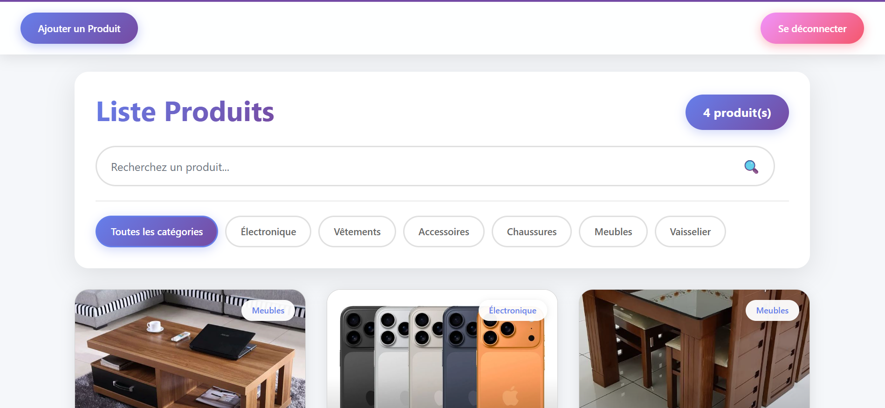
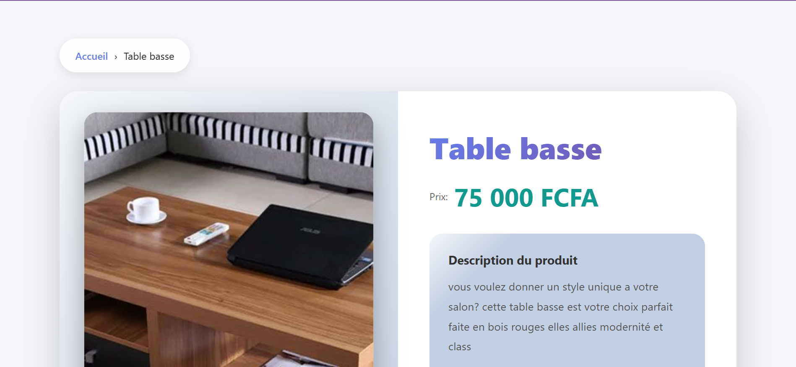
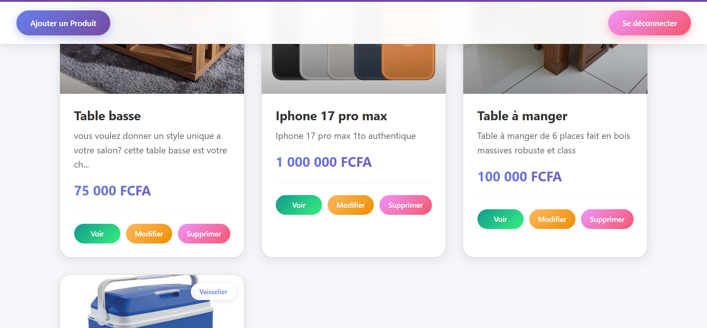
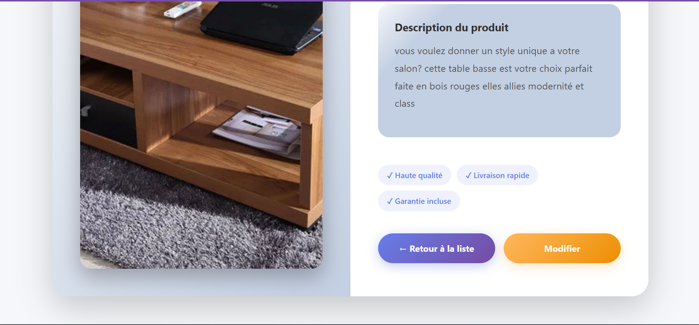
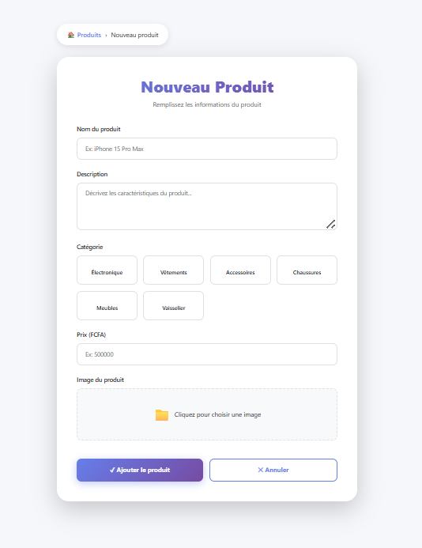
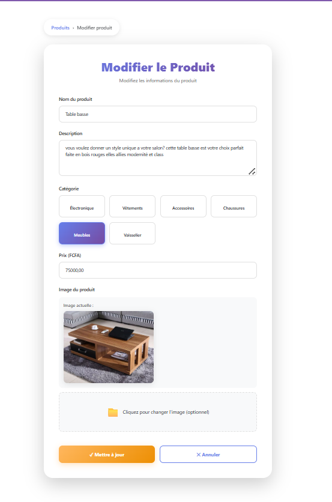
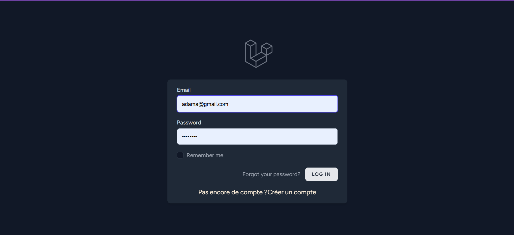
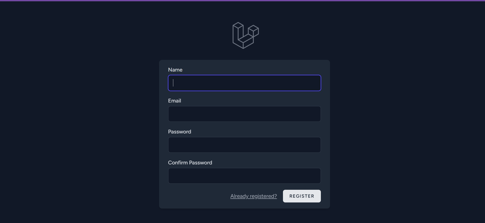
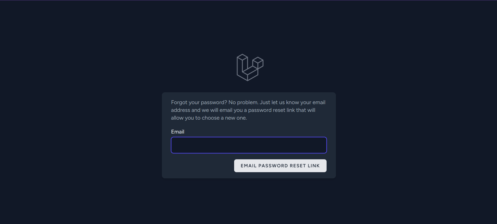

          Creation d'application de gestion de produits 

  1) Description du projet
Gest-produits est une application qui permet aux entreprises une meilleure gestion de leur produit et
stock avec un interface utilsateurs magnifique et simple

  2) Instruction d'installation

Pour creer le projet laravel j'ai utilise la commande suivante:

          "composer create-project laravel/laravel Gest-produits"

Aprés cela j'ai lancé et installé laravel breeze par les commande suivantes:
            composer require laravel/breeze --dev
            php artisan breeze:install

Aprés avoir installer laravel breeze on install les dependence de node avec la commande:
            npm install

en suite j'ai créé la base de donnes sur php my admin  que j'ai nommer gest_produit et faire la connexion avec le projet en changeant les donnes sur le fichiers .env 

ensuite j'ai fais lancer les migrations en créant le model produit avec 
             php artisan make:model Produit -m

 apres cela on a j'ai creer  le controller pour la gestion des crud ainsi que la ressources avec la commande:
             php artisan make:controller ProduitController --resource

et enfin j'ai lancer la commande qui permet d'enregistrer les images uploader lors de l'ajout des produits dans le storage la commande est la suivante:
                "php artisan storage:link"

  3) capture d'ecran de L'application

 
 
 
 
 
 

 
 

